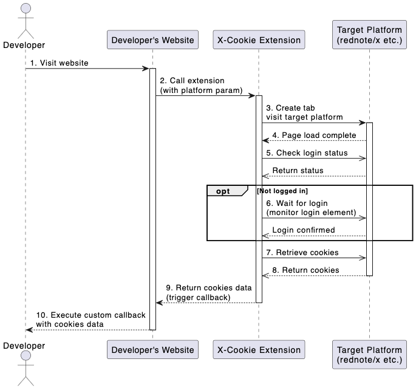

# X-Cookie Extension

A browser extension that helps developers retrieve cookies from target platforms.

## WorkFlow



## Usage

```pnpm
pnpm add @types/chrome --save-dev
```

```js
chrome.runtime.sendMessage(
  "extension_id",
  {
    platform: "rednote", // Supported platforms: "rednote", "x"
    timeout: 60000, // Timeout in milliseconds, default: 60000
  },
  (response) => {
    if (response.success) {
      console.log("Cookies retrieved:", response.cookies);
      // Handle cookies...
    } else {
      console.error("Failed:", response.message);
    }
  }
);
```
